  

---

## Tech Stack

  
  
  
  
  
  
  
  
  

---

## GitHub Stats

  

---

## Featured Projects

<table style="width: 100%; table-layout: auto;">
  <thead>
    <tr>
      <th width="5%"></th>
      <th width="30%" align="left">Repository</th>
      <th width="50%" align="left">Description</th>
      <th width="15%" align="left">Language</th>
    </tr>
  </thead>
  <tbody>
  <tr>
    <td>🎨</td>
    <td><b><a href='https://github.com/Diego0160/quickshell-games-launchers'>quickshell-games-launchers</a></b></td>
    <td>🎮 Quickshell launchers for Hyprland</td>
    <td><code>QML</code></td>
  </tr>
  <tr>
    <td>🎨</td>
    <td><b><a href='https://github.com/Diego0160/sddm-astronaut-theme'>sddm-astronaut-theme</a></b></td>
    <td>Series of modern looking themes for SDDM.</td>
    <td><code>QML</code></td>
  </tr>

  </tbody>
</table>

---

## Recent Activity

<table style="width: 100%; table-layout: auto;">
  <thead>
    <tr>
      <th width="5%"></th>
      <th width="30%" align="left">Repository</th>
      <th width="50%" align="left">Event</th>
      <th width="15%" align="left">Date</th>
    </tr>
  </thead>
  <tbody>
  <tr>
    <td>📤</td>
    <td><b>Diego0160</b>/quickshell-games-launchers</td>
    <td>pushed changes · 51fad04</td>
    <td><code>2026-09-25</code></td>
  </tr>
  <tr>
    <td>📤</td>
    <td><b>Diego0160</b>/quickshell-games-launchers</td>
    <td>pushed changes · f0256fa</td>
    <td><code>2026-09-25</code></td>
  </tr>
  <tr>
    <td>✨</td>
    <td><b>Diego0160</b>/quickshell-games-launchers</td>
    <td>created branch pr-upstream-fixes</td>
    <td><code>2026-09-25</code></td>
  </tr>
  <tr>
    <td>💬</td>
    <td><b>Eaquo</b>/quickshell-games-launchers</td>
    <td>commented on issue #14</td>
    <td><code>2026-09-25</code></td>
  </tr>
  <tr>
    <td>🔄</td>
    <td><b>Eaquo</b>/quickshell-games-launchers</td>
    <td>opened PR #14 · </td>
    <td><code>2026-09-25</code></td>
  </tr>
  <tr>
    <td>📤</td>
    <td><b>Diego0160</b>/quickshell-games-launchers</td>
    <td>pushed changes · 74ea77e</td>
    <td><code>2026-09-25</code></td>
  </tr>
  <tr>
    <td>📤</td>
    <td><b>Diego0160</b>/quickshell-games-launchers</td>
    <td>pushed changes · 6d7828f</td>
    <td><code>2026-09-25</code></td>
  </tr>
  <tr>
    <td>📤</td>
    <td><b>Diego0160</b>/quickshell-games-launchers</td>
    <td>pushed changes · c591167</td>
    <td><code>2026-09-25</code></td>
  </tr>

  </tbody>
</table>

---

## Now Playing

  

  

---

## Contribution Snake

  

---

  <i>Generated with Nix</i>
   
  
    <a href="https://github.com/Diego0160/Diego0160">Source</a>
    ·
    <a href="https://nixos.org">NixOS</a>
    ·
    <a href="https://quickshell.outfoxxed.me">Quickshell</a>
  
   
  
    
  
   
  
    
  

